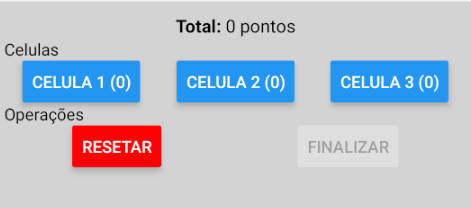

# Projeto prototipo contagem de Celula

- O aplicativo deverá selecionar uma imagem, podendo dar zoom e realizar a contagem de celulas. 

------

## Aplicativo


- O aplicativo é feito em Expo e pode ser testado pelo QRCode abaixo


## Código

Para usar o código, basta baixar, instalar primeiro as dependencias e executar:

```
    npm install
    npm start
```

O projeto utiliza a biblitoeca do react-native-zoom-reanimated, para animar as imagens, como é demonstrado no exemplo abaixo do arquivo /src/app/imagem/index.tsx:

```tsx
    <GestureHandlerRootView style={{flex: 1}}>
        {/** É necessário que a raiz do projeto seja usado o GestureHandlerRootView */}
        
        {/** ... */}

        {/* IMAGEM */}
        <Zoom>
            <Image
                source={{uri: imagem.url}}
                style={{
                    width: Dimensions.get('window').width,
                    height: Dimensions.get('window').width * 0.75, //Usa 75% da altura da tela
                    resizeMode: 'contain'
                }}
            />
        </Zoom>

        {/** ... */}
    </GestureHandlerRootView>
```

Também possui um componente para controlar as ações da contagem dos usuários, no arquivo /src/app/iamgem/contador.tsx:



```ts
    //Define a estrutura da pontuação e quantas celulas existem
    const [ contador, setContador ] = React.useState<Contador>({
        pontos: 0,
        celula1: 0,
        celula2: 0,
        celula3: 0
    })
    
    // ... 

    // -----------------------------------------------
    //Define o calculo assim que for  clicado na opção da contagem de celulas
    const adicionar = async (celula:'tipo1'|'tipo2'|'tipo3') => {
        //Busca os valores atuais do estado
        let { pontos, celula1, celula2, celula3 } = contador;

        if (celula == 'tipo1') {
            pontos += 5 //Esse tipo aumenta por exemplo 5 pontos
            celula1++
        } else if (celula == 'tipo2') {
            pontos += 10 //Esse tipo aumenta por exemplo 10 pontos
            celula2++
        } else {
            pontos += 20 //Esse tipo aumenta por exemplo 20 pontos
            celula3++
        }

        //Atualiza os valores
        setContador({ pontos, celula1, celula2, celula3 })
    }
```
--------
- O aplicativo trava a contagem assim que o total de pontos se torne >= 100, liberando a função de finalizar a análise, que apenas lança o resultado do contador para o componente principal

/src/app/imagem/contador.tsx
```tsx
    <Button title='Finalizar' color='green' onPress={() => onFinish(contador)} disabled={contador.pontos < 100}/>
```

/src/app/imagem/index.tsx
```tsx
     //Função que pega os dados do contador quando finalizado
    const handleFinish = (contador: Contador) => {
        Alert.alert('Resultado', `
            Pontos: ${contador.pontos}
            Celula 1: ${contador.celula1}
            Celula 2: ${contador.celula2}
            Celula 3: ${contador.celula3}
            `)
    }

    //...
    <Contador onFinish={handleFinish}/>
```

--------------
- Para questão de organização, também foi criado um arquivo que simula o acesso ao banco de dados. Devendo ser nele criado a lógica de acesso aos dados da aplicação
/src/services/imagens.tsx

```tsx
export type Imagem = {
    id: string,
    titulo: string,
    url: string
}

/**
 * Objeto que realiza acesso ao banco de dados
 */
const ImageService = {

    /**
     * Retorna a lista de imagens do "Firebase"
     */
    list: async (): Promise<Imagem[]> => {
        return [
            {id: '1', titulo: 'Imagem 1', url: 'https://anatpat.unicamp.br/DSCN32442+.JPG'},
            {id: '2', titulo: 'Imagem 2', url: 'https://encrypted-tbn0.gstatic.com/images?q=tbn:ANd9GcRYvdK32-n_Xc3FxmvidKo6OWmaN3qMp8iqkWpGj9yKdblp23akbNF2qHdDs6_fH0WLHDA&usqp=CAU'},
        ]
    },

    /**
     * Retorna os dado da imagem em si
     * @param id da iamgem
     */
    get: async(id: string) => {
        const imagens = [
            {id: '1', titulo: 'Imagem 1', url: 'https://anatpat.unicamp.br/DSCN32442+.JPG'},
            {id: '2', titulo: 'Imagem 2', url: 'https://encrypted-tbn0.gstatic.com/images?q=tbn:ANd9GcRYvdK32-n_Xc3FxmvidKo6OWmaN3qMp8iqkWpGj9yKdblp23akbNF2qHdDs6_fH0WLHDA&usqp=CAU'},
        ]

        return imagens[imagens.map(imagem => imagem.id).indexOf(id)]
    }
}

export const useImageService = () => ImageService
```